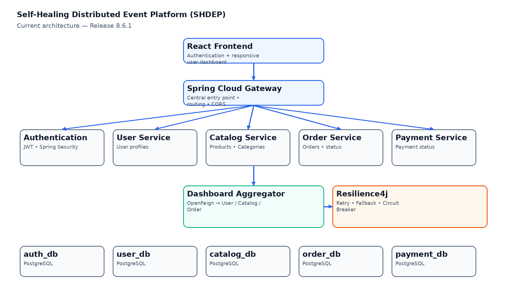
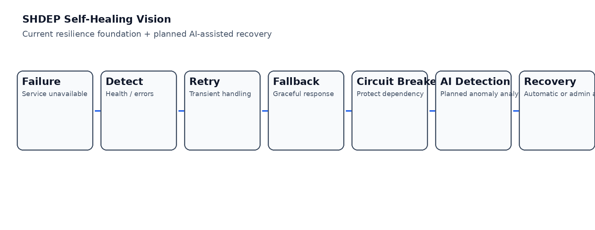
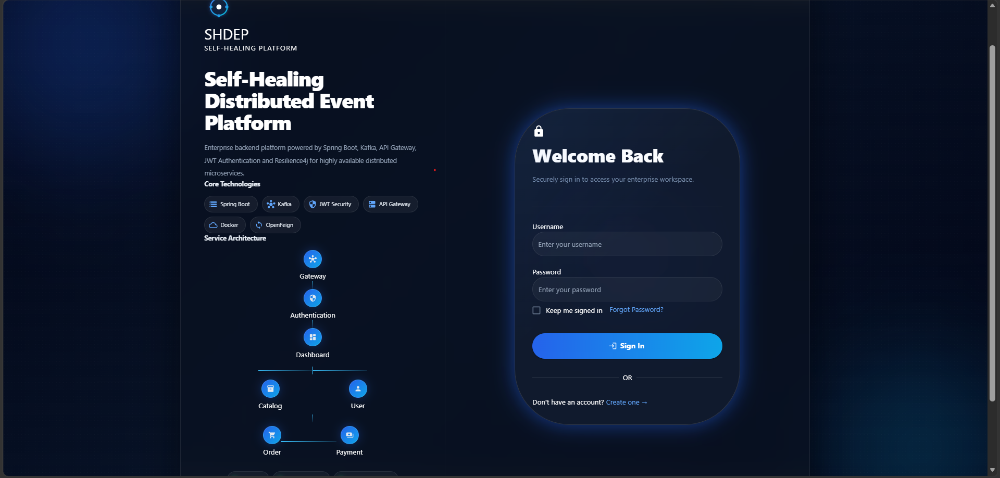
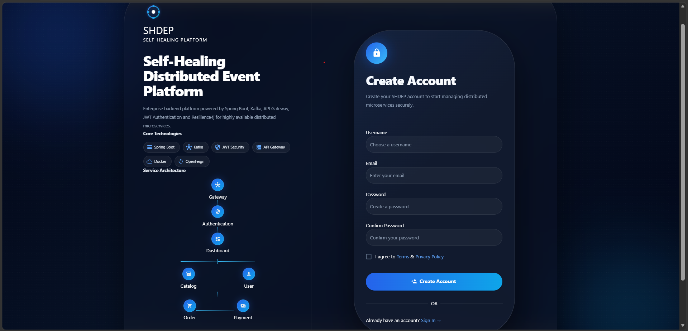
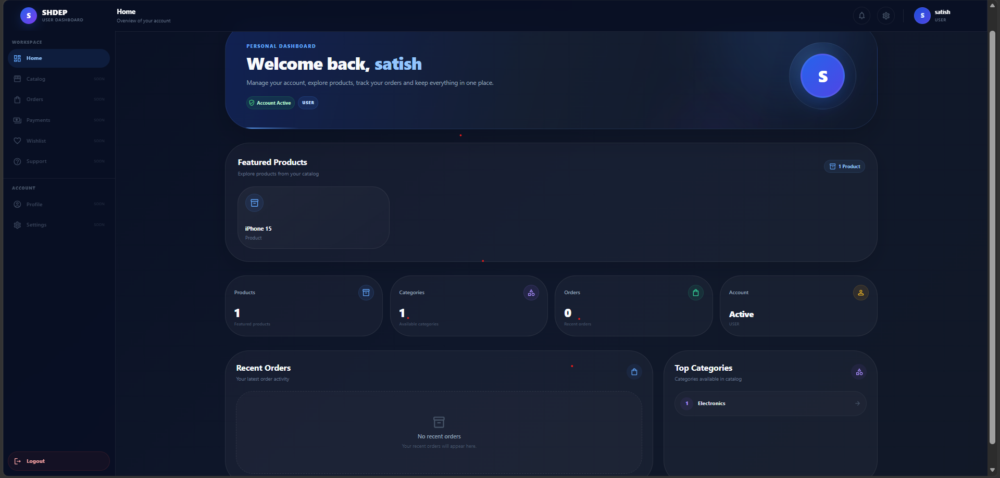

# 🚀 Self-Healing Distributed Event Platform (SHDEP)

> A cloud-native, microservices-based platform focused on secure authentication, service-to-service communication, fault tolerance, resilient service behavior, and a future AI-assisted self-healing layer.

SHDEP combines the core capabilities of a modern shopping platform with distributed-system engineering concepts. The project is being developed incrementally through release-based milestones, with the long-term goal of detecting service failures, handling them gracefully, and supporting automated or administrator-controlled recovery.

---

## 🎯 Project Vision

The central idea behind SHDEP is to move beyond a traditional shopping application and build a system that can tolerate failures instead of simply crashing when one dependency becomes unavailable.

```text
Service Failure
      ↓
Detection
      ↓
Retry / Fallback
      ↓
Circuit Breaker
      ↓
Graceful Degradation
      ↓
Recovery
      ↓
System Continues
```

The longer-term vision is to add an AI-assisted layer capable of identifying abnormal behavior and helping choose an appropriate recovery action, while also providing administrators with manual control.

---

## 🏗️ Architecture



### Current request flow

```text
React Frontend
      │
      ▼
API Gateway
      │
      ├── Authentication Service
      ├── User Service
      ├── Catalog Service
      ├── Order Service
      ├── Payment Service
      └── Dashboard Aggregator
                │
                ├── OpenFeign → User Service
                ├── OpenFeign → Catalog Service
                └── OpenFeign → Order Service
```

Each business service is designed around its own responsibility and PostgreSQL persistence.

---

# 🧩 Microservices

## 🔐 Authentication Service

Responsible for authentication and authorization.

### Features

- User registration
- User login
- JWT access-token generation
- Spring Security integration
- Role-based authentication
- Stateless authentication
- Secure API access

### Technologies

- Java 21
- Spring Boot
- Spring Security
- JWT
- Spring Data JPA
- PostgreSQL

---

## 👤 User Service

Manages user profile information independently from authentication records.

### Features

- Create user profile
- Fetch user profile
- Update user profile
- Profile persistence
- Dashboard profile integration

### Technologies

- Spring Boot
- Spring Data JPA
- PostgreSQL
- OpenFeign

---

## 🛍️ Catalog Service

Manages products and categories.

### Features

- Product management APIs
- Category management APIs
- Product retrieval
- Category retrieval
- Dashboard product integration

### Technologies

- Spring Boot
- Spring Data JPA
- PostgreSQL

---

## 📦 Order Service

Handles order management and order lifecycle.

### Features

- Create orders
- Fetch orders
- Order status management
- Order tracking
- Service integration

### Technologies

- Spring Boot
- Spring Data JPA
- PostgreSQL
- OpenFeign

---

## 💳 Payment Service

Handles payment-related operations and transaction status.

### Features

- Payment processing foundation
- Payment status management
- Transaction handling
- Order-service integration

### Technologies

- Spring Boot
- PostgreSQL
- OpenFeign

---

## 📊 Dashboard Aggregator Service

The Dashboard Aggregator provides a centralized view of data from multiple backend services.

```text
React Dashboard
      │
      ▼
Dashboard Aggregator
      │
      ├── User Service
      ├── Catalog Service
      └── Order Service
```

### Current dashboard capabilities

- User information
- Featured products
- Product categories
- Recent orders
- Summary information
- Responsive sidebar
- Mobile navigation
- Loading state
- Error state
- Retry handling
- Empty states
- JWT-aware dashboard access

---

# 🌐 API Gateway

Spring Cloud Gateway is used as the centralized entry point for frontend requests.

### Current routes

```text
/auth/**             → Authentication Service
/users/**            → User Service
/orders/**           → Order Service
/catalog/**          → Catalog Service
/payments/**         → Payment Service
/api/dashboard/**    → Dashboard Service
```

### Responsibilities

- Request routing
- Centralized API entry point
- CORS configuration
- Service access routing
- Gateway-level request handling

---

# 🔄 Inter-Service Communication

The current implementation primarily uses **OpenFeign** for synchronous service-to-service communication.

```text
Dashboard Service
       │
       ├── OpenFeign → User Service
       ├── OpenFeign → Catalog Service
       └── OpenFeign → Order Service
```

Kafka-based asynchronous communication is part of the planned evolution of the platform rather than the primary communication mechanism of the current 8.6.1 release.

---

# 🛡️ Resilience & Self-Healing Foundation

SHDEP has a resilience foundation using Resilience4j patterns such as:

- Retry
- Fallback
- Circuit Breaker

For example, when a dependent service is unavailable, the Dashboard Aggregator can fall back to a controlled response instead of allowing the complete dashboard request to fail.

### Failure-handling concept

```text
Dependency Failure
       ↓
Retry
       ↓
Still failing?
       ↓
Fallback
       ↓
Controlled response
```



---

# 🧠 AI-Assisted Self-Healing — Long-Term Vision

A major future objective is an AI-assisted failure detection and recovery layer.

```text
Microservices
     │
     ▼
Health / Metrics / Logs
     │
     ▼
Anomaly Detection
     │
     ├──────────────► Admin Alert
     │
     ▼
Recovery Recommendation
     │
     ├──────────────► Automatic Recovery
     │
     └──────────────► Manual Admin Action
```

The AI layer is a future evolution of the existing resilience foundation. It is not presented as fully implemented in Release 8.6.1.

---

# 📈 Monitoring & Observability

Spring Boot Actuator is part of the monitoring foundation.

### Current / planned direction

```text
Microservices
     │
     ▼
Spring Boot Actuator
     │
     ▼
Health + Metrics
     │
     ├── Prometheus (planned)
     └── Grafana (planned)
```

Future observability work includes:

- Service health monitoring
- Metrics collection
- Centralized logging
- Distributed tracing
- System health dashboard

---

# 🖥️ Frontend

The current frontend is being developed with React and Material UI.

### Authentication

```text
Login
  ↓
JWT
  ↓
Gateway
  ↓
Dashboard
```

### Dashboard

```text
Dashboard
│
├── Header
├── Responsive Sidebar
├── Welcome Section
├── Featured Products
├── Summary Cards
├── Recent Orders
└── Top Categories
```

The dashboard is connected to backend APIs rather than using hardcoded business data.

---

# 📸 Project Screenshots

Add actual running-application screenshots here as frontend modules are completed.

Recommended screenshots:






---

# 🛠️ Technology Stack

| Category | Technologies |
|---|---|
| Language | Java 21 |
| Backend | Spring Boot |
| Security | Spring Security, JWT |
| Database | PostgreSQL |
| ORM | Spring Data JPA / Hibernate |
| API Gateway | Spring Cloud Gateway |
| Communication | OpenFeign |
| Frontend | React |
| UI | Material UI |
| Build Tool | Maven |
| Testing | JUnit |
| API Testing | Postman |
| Version Control | Git & GitHub |
| Monitoring | Spring Boot Actuator |
| Resilience | Resilience4j |
| Messaging | Apache Kafka — Planned |
| Containerization | Docker — Planned |
| Orchestration | Kubernetes — Planned |
| CI/CD | Planned |

---

# 📁 Repository Structure

```text
SHDEP_PROJECT/
│
├── Authentication/
├── User/
├── Order/
├── Payment/
├── Catalog/
├── Dashboard/
├── API-Gateway/
├── Frontend/
└── README.md
```

---

# 🚀 Release Roadmap

## ✅ Completed / Implemented

- Authentication Service
- JWT Authentication
- User Service
- Order Service
- Payment Service
- Catalog Service
- API Gateway
- OpenFeign communication
- Dashboard Aggregator
- Resilience4j Retry/Fallback foundation
- React authentication frontend
- React dashboard
- Responsive dashboard navigation
- Release 8.6.1 dashboard improvements

## 🔄 Next Development

- Catalog frontend
- Product search
- Category filtering
- Product details
- Cart workflow
- Order frontend
- Payment frontend
- Admin dashboard
- Advanced monitoring

## 🔮 Planned

### Event-Driven Architecture

- Apache Kafka
- Event-driven communication
- Asynchronous workflows
- Event-based order processing

### Self-Healing

- Advanced failure detection
- AI-assisted anomaly detection
- Failure classification
- Automated recovery
- Admin-controlled manual recovery

### DevOps

- Docker
- Kubernetes
- CI/CD pipeline

### Observability

- Prometheus
- Grafana
- Centralized logging
- Distributed tracing

---

# 🎯 Learning Objectives

SHDEP is being developed to gain practical experience in:

- Microservices architecture
- Distributed systems
- Secure backend development
- JWT authentication
- Service-to-service communication
- Fault tolerance
- Resilience patterns
- Event-driven architecture
- Cloud-native development
- Observability
- DevOps
- AI-assisted backend systems
- System design

---

# 💡 Why SHDEP?

A traditional application can behave like:

```text
Service Failure
      ↓
Request Failure
      ↓
Application Failure
```

SHDEP aims to evolve toward:

```text
Service Failure
      ↓
Detection
      ↓
Retry / Fallback
      ↓
Graceful Degradation
      ↓
Recovery
      ↓
System Continues
```

The long-term goal is to build a platform capable of detecting, analysing and responding to distributed failures with minimal manual intervention.

---

# 👨‍💻 Author

## Nitish Kumar

**Java Backend Developer | Spring Boot Enthusiast**

Areas of focus:

- Java
- Spring Boot
- Microservices
- Distributed Systems
- System Design
- Event-Driven Architecture
- Cloud-Native Development
- DevOps
- Kubernetes
- AI-assisted Backend Systems

---

# ⭐ Project Status

**SHDEP is actively under development.**

The project is being developed through release-based milestones, with each release adding backend services, frontend functionality, resilience mechanisms, distributed-system capabilities and, eventually, AI-assisted self-healing.
